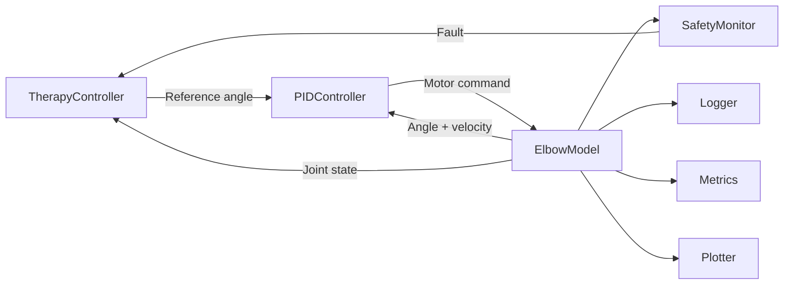
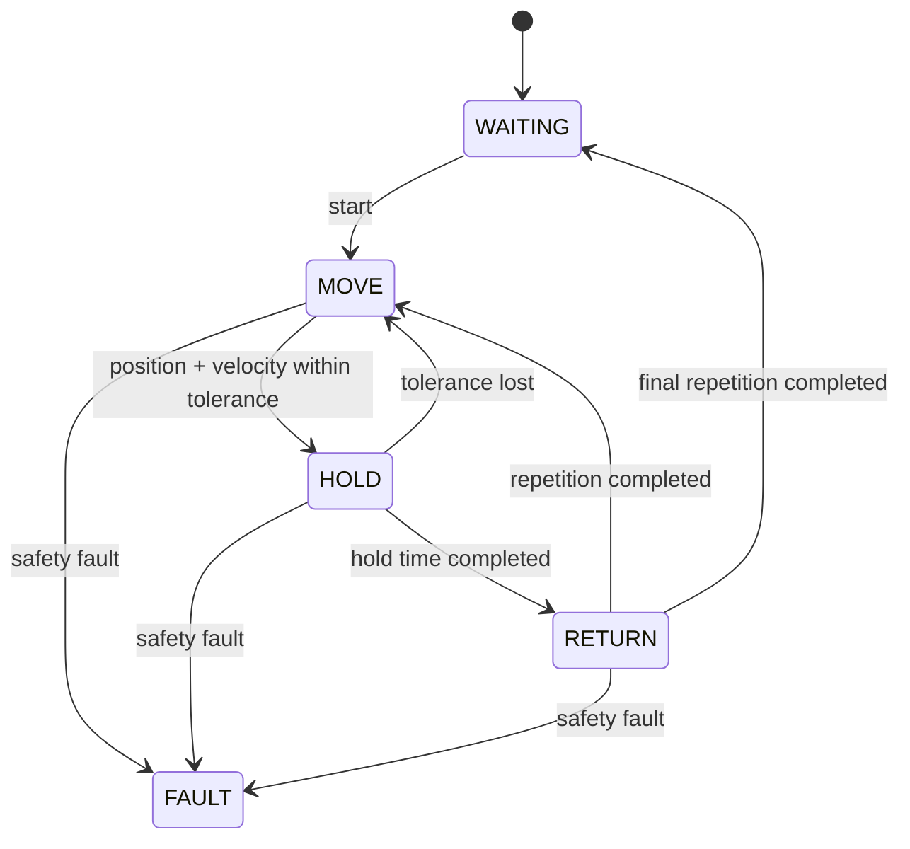
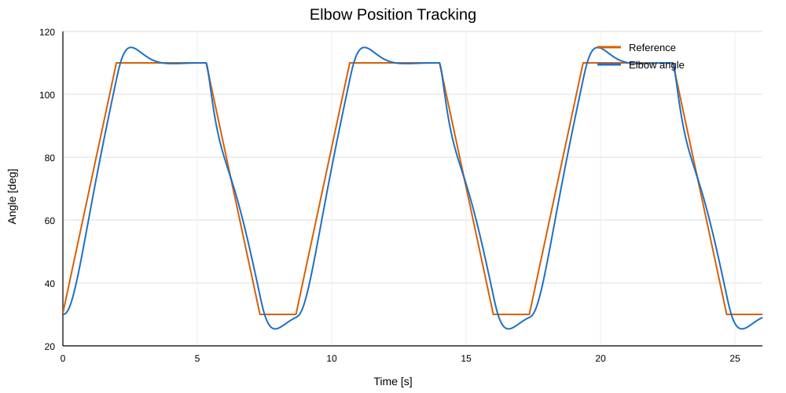
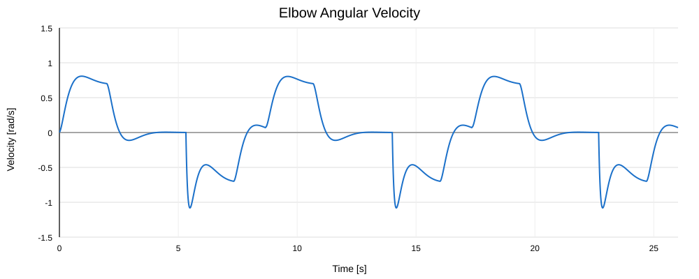
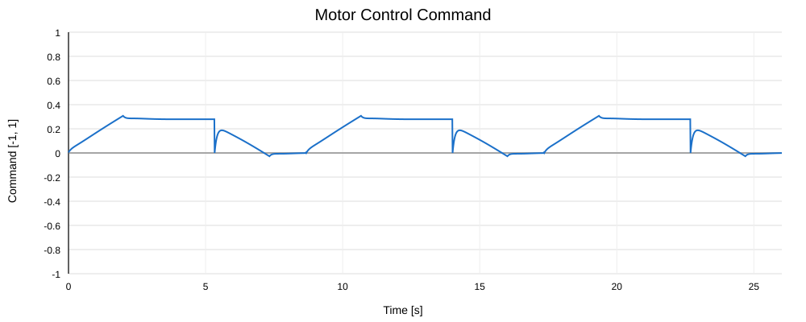

<div align="center">

# Rehab Control Simulator

### C++ closed-loop control simulator for 1-DOF elbow rehabilitation

A compact rehabilitation-control project combining **biomechanical simulation, PID control, reference shaping, therapy state management, safety monitoring, session metrics and automatic SVG plotting**.


</div>

---

## Overview

**Rehab Control Simulator** is a C++ simulation of a motor-assisted elbow rehabilitation system.

The project models a patient's elbow as a **single rotational degree of freedom**, including inertia, damping and passive muscular resistance. A closed-loop PID controller drives the joint between configurable rehabilitation angles while a therapy state machine manages repetitions, holding phases and returns to the initial position.

The project was designed as a compact control and biomedical-software exercise rather than as a full clinical rehabilitation platform. The focus is on the interaction between:

| Control | Simulation | Safety | Analysis |
|---|---|---|---|
| PID position control | Elbow dynamics | Joint limits | CSV logging |
| Anti-windup | Patient resistance | Stall detection | Session metrics |
| Derivative on measurement | Motor torque | Encoder faults | Automatic SVG plots |
| Reference shaping | 100 Hz simulation | Resistance limits | Repeatability analysis |

> **Simulation project only.** The parameters and safety thresholds used here are engineering values for the simulator and must not be interpreted as validated clinical limits.

---

## System Architecture



The simulator follows the control structure:

\[
\text{Therapy reference}
\rightarrow
\text{PID}
\rightarrow
\text{Motor}
\rightarrow
\text{Elbow}
\rightarrow
\text{Feedback}
\]

The complete simulation runs with:

\[
\Delta t = 0.01\text{ s}
\]

corresponding to a control frequency of:

\[
f_s = 100\text{ Hz}
\]

---

## Elbow Model

The elbow is represented by a rotational dynamic model:

\[
J\ddot{\theta}
=
\tau_{motor}
-
\tau_{resistance}
-
b\dot{\theta}
\]

where the motor torque is:

\[
\tau_{motor}
=
u\tau_{max}
\]

with:

\[
-1 \leq u \leq 1
\]

Patient resistance is represented using a passive stiffness-damping model:

\[
\tau_{resistance}
=
k_r(\theta-\theta_{rest})
+
b_r\dot{\theta}
\]

### Model parameters

| Parameter | Value | Description |
|---|---:|---|
| Initial / resting angle | 30° | Neutral simulated elbow position |
| \(J\) | 0.08 kg·m² | Rotational inertia |
| \(b\) | 0.15 N·m·s/rad | Joint damping |
| \(k_r\) | 1.0 N·m/rad | Patient stiffness |
| \(b_r\) | 0.20 N·m·s/rad | Patient damping |
| \(\tau_{max}\) | 5.0 N·m | Maximum simulated motor torque |

Angles are handled internally in **radians**, while user-facing results are expressed primarily in **degrees**.

---

## Control Design

Defining:

\[
x = \theta-\theta_{rest}
\]

the linearized model becomes:

\[
0.08\ddot{x}
+
0.35\dot{x}
+
x
=
5u
\]

and therefore the plant transfer function is:

\[
\boxed{
G(s)=
\frac{5}
{0.08s^2+0.35s+1}
}
\]

The controller follows:

\[
u(t)
=
K_pe(t)
+
K_i\int e(t)\,dt
-
K_d\dot{\theta}(t)
\]

with the final gains:

| Gain | Value |
|---|---:|
| \(K_p\) | 0.574 |
| \(K_i\) | 1.344 |
| \(K_d\) | 0.154 |

The gains were obtained from a continuous pole-placement design using nominal targets of approximately **5% overshoot** and **2 s settling time**.

The implementation additionally includes:

- output saturation between `-1` and `1`;
- conditional integration anti-windup;
- derivative on measurement instead of derivative on error;
- discrete execution at 100 Hz.

### Design vs implemented response

The pole-placement calculation defines the desired closed-loop denominator, but the classical second-order overshoot estimate does not exactly represent the complete implemented response.

With an instantaneous `30° → 110°` step reference, the simulated system originally reached approximately:

\[
122.57^\circ
\]

corresponding to roughly:

\[
15.7\%
\]

overshoot relative to the 80° movement.

This motivated the introduction of **reference shaping** rather than repeatedly retuning the PID.

---

## Reference Shaping

Instead of commanding an instantaneous:

\[
30^\circ \rightarrow 110^\circ
\]

the therapy controller generates a progressive reference limited to:

\[
40^\circ/s
\]

At 100 Hz, the reference therefore changes by:

\[
40^\circ/s \times 0.01s
=
0.4^\circ
\]

per simulation step.

For example:

```text
30.0°
30.4°
30.8°
31.2°
...
109.6°
110.0°
```

This produces a considerably smoother rehabilitation trajectory while preserving the original PID controller.

### Effect of reference shaping

| Metric | Step reference | Shaped reference |
|---|---:|---:|
| Maximum flexion angle | ≈ 122.57° | **114.92°** |
| Overshoot above 110° | ≈ 12.57° | **4.92°** |
| Relative overshoot | ≈ 15.7% | **≈ 6.15%** |
| Minimum return angle | ≈ 7.58° | **25.39°** |
| Undershoot below 30° | ≈ 22.42° | **4.61°** |

The reference shaper therefore reduced both flexion overshoot and return undershoot without modifying the underlying controller gains.

---

## Therapy State Machine

A rehabilitation session is managed using five states:



For the current demonstration session:

| Parameter | Value |
|---|---:|
| Initial angle | 30° |
| Target angle | 110° |
| Reference speed | 40°/s |
| Repetitions | 3 |
| Hold duration | 2 s |
| Position tolerance | ±1° |
| Velocity tolerance | ±0.15 rad/s |

A position is not considered reached simply because the elbow passes through the target.

Both conditions must be satisfied:

\[
|\theta_{target}-\theta|
\leq
\theta_{tol}
\]

and:

\[
|\dot{\theta}|
\leq
\omega_{tol}
\]

This prevents the state machine from entering `HOLD` while the joint is still moving rapidly through the target.

---

## Safety Monitoring

`SafetyMonitor` operates independently from the therapy controller and evaluates the simulated joint continuously.

| Fault | Condition |
|---|---|
| `LIMIT` | Joint leaves the configured angular range |
| `STALL` | High motor command with insufficient movement |
| `ENCODER` | Invalid / non-finite position or velocity |
| `RESISTANCE` | Patient resistance torque exceeds the configured threshold |
| `INVALID_DATA` | Invalid motor command, patient torque or simulation time step |

Current simulator thresholds include:

```text
Joint range:             0° – 140°
Stall command:           ≥ 0.70
Stall velocity:          ≤ 0.02 rad/s
Stall duration:          ≥ 0.50 s
Resistance threshold:    3.0 Nm
```

Stall monitoring is enabled only while movement is expected, preventing a stationary `HOLD` state from being incorrectly classified as a stall.

The simulator validates controller gains, therapy settings, safety thresholds and runtime inputs. Invalid values such as non-finite numbers, non-positive time steps, zero repetitions or non-positive movement speeds are rejected before they can produce undefined simulation behaviour.

The main loop also has a configurable maximum duration of **120 s**. If the therapy cannot finish within that time, it enters `FAULT` instead of running indefinitely.

The four fault paths were also manually validated through fault injection during development.

---

## Simulation Results

The final three-repetition session produced:

| Metric | Result |
|---|---:|
| Session duration | **26.020 s** |
| Maximum angle | **114.921°** |
| Minimum angle | **25.391°** |
| Maximum absolute velocity | **1.081 rad/s** |
| Maximum absolute motor command | **0.308** |
| Tracking RMSE | **4.514°** |
| HOLD mean absolute error | **0.162°** |

The global RMSE includes the tracking delay during the moving reference ramps.

During `HOLD`, where accurate positioning is more relevant, the mean absolute error falls to:

\[
\boxed{0.162^\circ}
\]

The three repetitions also show highly repeatable simulated behaviour.

---

## Position Tracking

<p align="center">
  
</p>

The reference trajectory and simulated elbow angle can be compared directly across the complete rehabilitation session.

The controller follows both flexion and extension trajectories, while small transient overshoots appear when the moving reference reaches its final position.

---

## Angular Velocity

<p align="center">
  
</p>

Positive velocity corresponds primarily to elbow flexion, while negative velocity represents the return movement.

During each `HOLD` phase, velocity converges toward zero.

---

## Motor Command

<p align="center">
  
</p>

The normalized command is constrained to:

\[
-1\leq u\leq1
\]

while the final session reaches only:

\[
|u|_{max}=0.308
\]

showing that the simulated actuator is not being driven through saturation during normal operation.

---

## Automatic Session Analysis

The simulator generates its own analysis outputs directly from C++.

No Python, plotting framework or external numerical library is required.

```text
Simulation
   │
   ├── session.csv
   │
   ├── metrics.txt
   │
   └── figures/
       ├── position_tracking.svg
       ├── velocity.svg
       └── motor_command.svg
```

`Logger` stores every simulation step, `Metrics` calculates session-level performance values, and `Plotter` generates the figures directly as SVG files.

The CSV contains one header followed by one row per simulation step:

```text
time,state,target_angle,angle,velocity,motor_command,error
```

---

## Project Structure

```text
Rehab_Control_Simulator/
│
├── include/
│   ├── ElbowModel.hpp
│   ├── PIDController.hpp
│   ├── TherapyController.hpp
│   ├── SafetyMonitor.hpp
│   ├── Logger.hpp
│   ├── Metrics.hpp
│   ├── Plotter.hpp
│   └── SimulationConfig.hpp
│
├── src/
│   ├── main.cpp
│   ├── ElbowModel.cpp
│   ├── PIDController.cpp
│   ├── TherapyController.cpp
│   ├── SafetyMonitor.cpp
│   ├── Logger.cpp
│   ├── Metrics.cpp
│   └── Plotter.cpp
│
├── tests/
│   └── test_main.cpp
│
├── output/
│   ├── session.csv
│   ├── metrics.txt
│   └── figures/
│       ├── position_tracking.svg
│       ├── velocity.svg
│       └── motor_command.svg
│
├── CMakeLists.txt
├── .gitignore
├── LICENSE
└── README.md
```

### Main components

| Component | Responsibility |
|---|---|
| `ElbowModel` | Simulates elbow, motor and passive patient dynamics |
| `PIDController` | Closed-loop position controller |
| `TherapyController` | Reference generation and therapy state machine |
| `SafetyMonitor` | Detects unsafe or invalid simulated conditions |
| `Logger` | Stores complete session data in CSV |
| `Metrics` | Calculates quantitative performance metrics |
| `Plotter` | Generates SVG figures directly from C++ |
| `SimulationConfig` | Stores PID, therapy, safety, timing and output settings |

---

## Configuration

All user-adjustable simulation parameters are grouped in:

```text
include/SimulationConfig.hpp
```

`main.cpp` creates a single configuration object and passes its values to the PID controller, therapy controller, safety monitor and output components:

```cpp
const SimulationConfig config;
```

Common settings can therefore be changed in one place:

```cpp
double targetAngleDegrees = 110.0;
int repetitions = 3;
double holdDuration = 2.0;
double movementSpeedDegreesPerSecond = 40.0;
double timeStep = 0.01;
double maximumSimulationTime = 120.0;
```

Angles exposed as configuration values use degrees for readability. They are converted to radians before entering the control and physical models.

---

## Build and Run

### Requirements

- Windows
- C++17-compatible compiler
- CMake

No Python environment or external plotting dependency is required.

### Build

From the repository root:

```powershell
cmake -S . -B build
cmake --build build --config Debug
```

### Run

With the current output configuration, run the executable from the generated `Debug` directory:

```powershell
cd build\Debug
.\Rehab_Control_Simulator.exe
```

After the session finishes, the simulator writes the results to:

```text
output/
```

including the CSV data, calculated metrics and SVG figures.

### Tests

Automated tests cover the PID output and input validation, therapy state transitions, safety faults, elbow resistance-torque synchronization and CSV logging.

Run them from the repository root after building:

```powershell
ctest --test-dir build -C Debug --output-on-failure
```

The project enables strict compiler warnings (`/W4 /permissive-` with MSVC, or `-Wall -Wextra -Wpedantic` with compatible compilers).

---

## Scope

The project intentionally remains a compact control simulator.

It currently focuses on:

- one elbow rotational DOF;
- passive patient resistance;
- motor-assisted position control;
- configurable rehabilitation repetitions;
- basic simulated safety supervision;
- quantitative session analysis.

More complex features such as multi-joint biomechanics, physiological muscle models, hardware-in-the-loop operation, 3D visualization or clinical decision logic are intentionally outside the current scope.

---

## What This Project Demonstrates

This project combines concepts from **control engineering, biomedical engineering and software development** in a single reproducible simulation.

In particular, it demonstrates the complete path from:

\[
\text{physical model}
\rightarrow
\text{transfer function}
\rightarrow
\text{controller design}
\rightarrow
\text{discrete implementation}
\rightarrow
\text{safety logic}
\rightarrow
\text{quantitative validation}
\]

rather than treating the PID controller as an isolated software component.

---

## License

See the [`LICENSE`](LICENSE) file for details.

---

<div align="center">

**C++ · Control Systems · Biomedical Engineering · Simulation**

</div>
